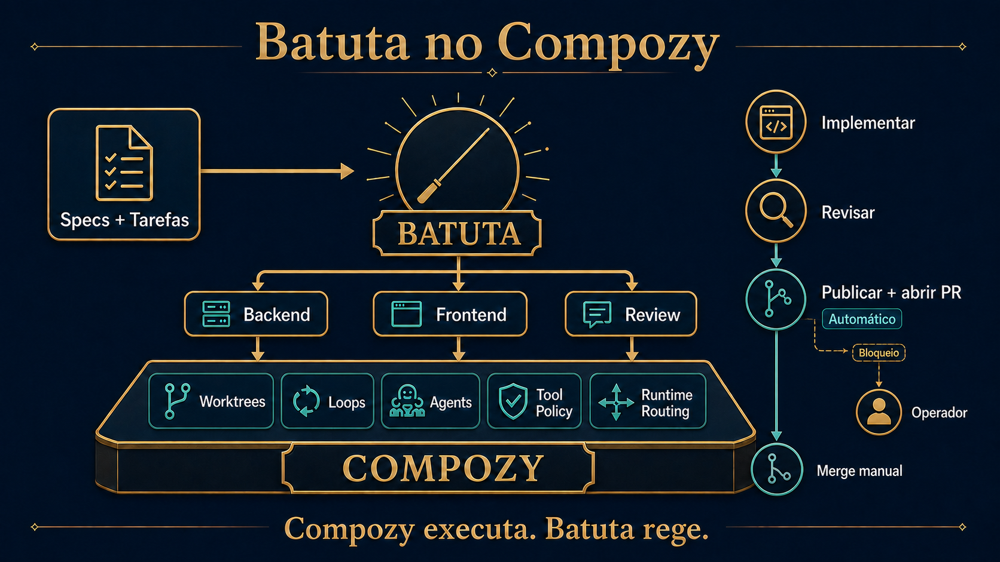

# batuta-compozy

> 🇺🇸 [English version](README.md)

O Batuta é um agente maestro para o
[CompozyOS](https://www.compozy.com/docs/). Você descreve o resultado; o
Batuta escreve o SDD pelo `spec-cycle` bundled, cria as tasks, faz o
inventário automático de executores, classifica cada task por domínio × complexidade,
arquiva uma matriz imutável de runtimes e conduz uma entrega limitada por runs
novos do Compozy. Ele nunca implementa o código da feature diretamente.

A entrega usa `auto_commit=true`, fallback limitado em novo run, revisão
independente e publicação automática do HEAD exato, sem gate humano de publicação
no caminho saudável. Push e abertura do PR são automáticos; o merge continua manual.
O operador participa apenas quando faltam requisitos de
produto ou existe um bloqueio externo real, como credenciais ou remote.

O Batuta é um projeto independente da comunidade, não um componente oficial
ou endossado do CompozyOS. O CompozyOS vive em
[github.com/compozy/compozy](https://github.com/compozy/compozy).



```text
conversa → SDD → tasks → inventário → matriz domínio × complexidade
                                         ↓
relatório ← verificar PR ← publicar ← revisar ← tentativa 1 no worktree isolado
                                         ↓ somente task falha
                                  tentativa 2 (novo run)
```

## Instalar

A `v0.1.0-beta.4` continua sendo a release publicada no GitHub. Esta branch
prepara a `v0.1.0-beta.5`. O SDK Go oficial `v0.3.0-beta.21` é usado diretamente,
sem `replace` ou dependência de fork. A promoção pública ainda aguarda um
binário oficial do Compozy com `config_overrides` em filhos `run-loop`; o
preview local compatível é suportado para desenvolvimento.

Pré-requisitos:

- daemon CompozyOS compatível;
- extensão bundled `spec-cycle` habilitada;
- ao menos um modelo autenticado em `compozy provider models list`.

```bash
compozy extension install github:franciscpd/batuta-compozy --allow-unverified --yes
compozy extension enable batuta
```

`--allow-unverified` é o consentimento explícito para uma fonte da comunidade;
a verificação de integridade do archive continua ativa. Veja
[docs/verify.md](docs/verify.md).

Atualizar: `compozy extension update batuta --allow-unverified --yes` ·
Remover: `compozy extension remove batuta --global`

Release publicada atual: [`v0.1.0-beta.4`](docs/releases/0.1.0-beta.4.md).
Próxima candidata: [`v0.1.0-beta.5`](docs/releases/0.1.0-beta.5.md).
## Uso

Abra uma sessão Compozy com o agente `batuta` no workspace do projeto e
descreva a mudança. O Batuta pergunta apenas sobre requisitos e depois:

1. roda `cy-create-spec` e aguarda a aprovação do contrato de produto;
2. roda `cy-create-tasks` e valida os metadados canônicos;
3. inventaria Compozy, Codex, OpenCode e Cursor Agent sem expor secrets;
4. escolhe IDs exatos de provider/model presentes no catálogo vivo do Compozy;
5. arquiva regras exatas de `type + complexity` sem alterar config armazenada;
6. inicia a tentativa 1 de `batuta-deliver` com cap 4 e um deadline de 14.400 segundos;
7. implementa, revisa, tenta novamente só as tasks falhas em novo run dentro do orçamento original, commita e
   abre um PR para a fase de entrega.

Por exemplo, uma célula frontend pode selecionar Cursor Agent com o ID ACP
exato `cursor/grok-4.6[effort=high,fast=true]`, enquanto backend usa outro
executor/modelo. Configurações dos executores externos informam a seleção de
capacidade, mas somente bindings exatos reportados pelo Compozy executam.

Os contratos completos estão em [docs/how-it-works.md](docs/how-it-works.md) e
[docs/architecture.md](docs/architecture.md). O roadmap da apresentação está
em [docs/images/batuta-next-roadmap.png](docs/images/batuta-next-roadmap.png).

## Limitações conhecidas

- A promoção pública beta.5 aguarda um binário oficial do Compozy com
  `config_overrides` em filhos `run-loop`; a validação local usa um preview compatível.
- As sessões dos executores não são visualmente aninhadas e permanecem
  active/idle após a conclusão terminal normal.
- Forge provider, remote ou credencial ausente vira blocker; uma compare URL
  nunca é tratada como PR publicado.

## Saiba mais

- [Como funciona](docs/how-it-works.md) · [Verificar e instalar](docs/verify.md)
- [Arquitetura](docs/architecture.md) ·
  [Estudo de caso](docs/case-studies/version-subcommand.md)
- [Contribuindo](CONTRIBUTING.md) · [Licença MIT](LICENSE)
